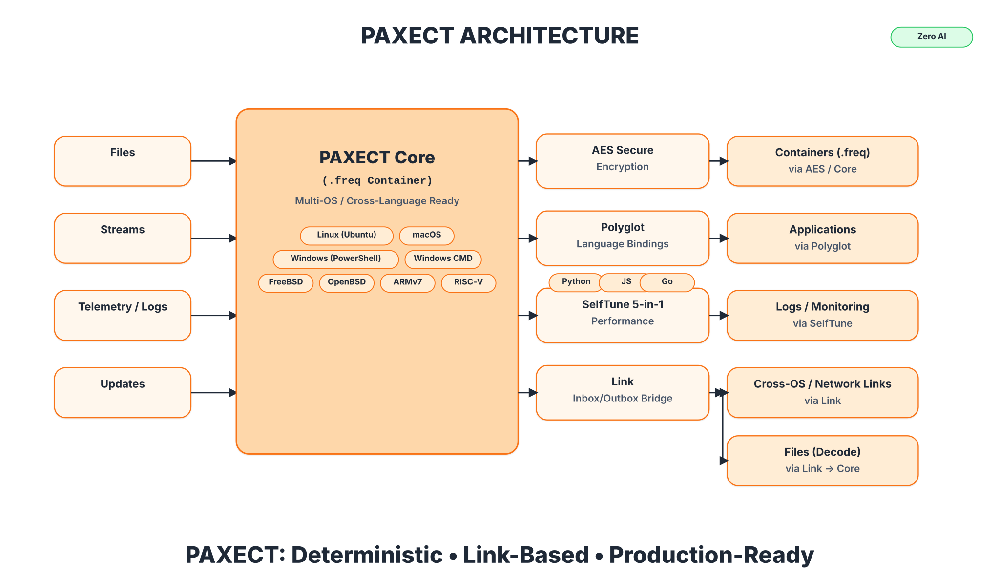

<p align="center">
  
</p>


[](../../stargazers)
[](./LICENSE)
[](../../actions)
[](../../actions)
[](../../issues)
[](../../discussions)
[](./SECURITY.md)
<a href="https://github.com/PAXECT-Interface/paxect-polyglot-plugin/releases/latest">
  
</a>


---

# 🌐 PAXECT Polyglot — Cross-Language Deterministic Bridge

**Status:** v1.0.0 — Initial Public Release — October 22, 2025

**Deterministic, offline-first, and reproducible — built for secure data pipelines and NIS2-ready digital hygiene.**

PAXECT Polyglot provides **secure, deterministic interoperability** across languages, runtimes, and operating systems.
It’s a **reproducible, verifiable data bridge** between **Python, Node.js, and Go**, extensible to any runtime through a common binary interface powered by **PAXECT Core**.

**Plug-and-play:** zero dependencies, no vendor lock-in, and cross-OS reproducibility.
**No cloud, no AI heuristics — just byte-for-byte deterministic transport with checksum-verified integrity (CRC32 + SHA-256).**

---

### 🧩 Overview

**PAXECT Polyglot** is a **multi-language bridge** enabling **lossless, reproducible data exchange** between heterogeneous runtimes.
It ensures that both binary and textual data remain **bit-identical** when transferred between languages, platforms, and operating systems.

Unlike traditional serialization frameworks — **JSON, Protobuf, MsgPack** — which introduce drift, rounding, or type loss,
Polyglot uses the **PAXECT Core container format** to guarantee **checksum-verified integrity and deterministic reproducibility**.

It acts as the **glue layer** between analytical systems, edge devices, and enterprise runtimes —
allowing **Python pipelines**, **Go microservices**, and **Node.js orchestration layers** to communicate reproducibly and securely.

---


## ⚙️ Key Features

* 🔄 **Cross-Language Consistency** — deterministic I/O between Python · Node.js · Go
* 🔐 **Integrity-Checked Transport** — CRC32 + SHA-256 verification
* 🧠 **No-AI / No-Heuristics Policy** — deterministic, auditable behavior
* 🧰 **Self-Contained Binary Bridge** — no external runtime dependencies
* 💻 **Cross-OS Reproducibility** — identical output on Linux · macOS · Windows · Android · iOS
* 🧩 **Polyglot Extensibility** — easily embeddable in Rust, C++, Java, or Swift environments

---

## 🌍 Supported Languages & Platforms

**Operating Systems**

| Supported                         | Architecture  |
| --------------------------------- | ------------- |
| Linux (Ubuntu, Debian, Fedora)    | x86_64, ARMv8 |
| Windows 10/11                     | x86_64        |
| macOS 13+ (Intel & Apple Silicon) | arm64, x86_64 |
| Android (via Termux)              | ARMv7, ARM64  |
| iOS (via Pyto)                    | ARM64         |
| FreeBSD / OpenBSD                 | Experimental  |
| RISC-V                            | Planned       |

**Languages**

| Tier            | Languages                                                                           |
| --------------- | ----------------------------------------------------------------------------------- |
| **Official**    | Python, Node.js, Go                                                                 |
| **Also Tested** | Rust, Java, C#, C/C++, Swift, Kotlin, Ruby, PHP, R, Julia, MATLAB, Bash, PowerShell |

---

## 🧠 Core Capabilities

| Capability                     | Description                                         |
| ------------------------------ | --------------------------------------------------- |
| **Deterministic Encoding**     | Bit-identical serialization across platforms        |
| **Secure Hash Validation**     | Automatic CRC32 + SHA-256 integrity checks          |
| **Cross-Runtime Adaptability** | Supports stdin/stdout piping between runtimes       |
| **Containerized Protocol**     | Leverages PAXECT Core for structured binary framing |
| **Offline Operation**          | Requires no network or external calls               |


---


## 🎯 Purpose

This suite validates the **PAXECT Polyglot Plugin**, ensuring:

* Deterministic behavior across platforms and languages
* UTF-8 strictness and proper error recovery
* CI/CD-safe fail-and-recover cycles
* Round-trip reproducibility (upper/lower/text transforms)
* Continuous operation under sustained load

---

## ⚙️ Quick Setup

```bash
# Clone the Polyglot repository
git clone https://github.com/paxect/paxect-polyglot.git
cd paxect-polyglot

# (Optional) create a virtual environment
python3 -m venv .venv && source .venv/bin/activate

# No extra dependencies required (stdlib-only)
python paxect_polyglot_plugin.py --mode health && echo "OK"
```

> 🪟 *Windows tip:* Replace `python3` with `py -3` or `python` depending on your environment.

---

## 🚀 Demos Included

All demos are deterministic, self-contained, and safe to run locally or in CI.

| Demo | Script                                 | Description                               | Status |
| ---- | -------------------------------------- | ----------------------------------------- | ------ |
| 00   | `00_env_smoke.py`                      | Environment sanity check                  | ✅      |
| 01   | `01_packaging_provenance.py`           | Provenance and SHA-256 verification       | ✅      |
| 02   | `02_core_integration.py`               | Bridge between Core and Polyglot          | ✅      |
| 03   | `03_universal_smoke.py`                | Cross-OS reproducibility baseline         | ✅      |
| 04   | `04_android_adb_smoke.py`              | Android ADB bridge validation             | ✅      |
| 05   | `05_ios_http_bridge_ping.py`           | iOS HTTP bridge and gateway smoke         | ✅      |
| 06   | `06_toolchain_inventory.py`            | System & language inventory               | ✅      |
| 07   | `07_5_in_1_smoke.py`                   | Combined bridge and runtime validation    | ✅      |
| 09   | `09_universal_end_to_end_polyglot.py`  | Python → Node → Go roundtrip              | ✅      |
| 10   | `10_polyglot_ci_verifier.py`           | CI matrix orchestrator                    | ✅      |
| 11   | `demo_11_fail_and_recover_polyglot.py` | UTF-8 corruption fail & self-recover demo | ✅      |
| 12   | `demo_12_stress_test_polyglot.py`      | One-minute reliability & stress test      | ✅      |

Run all demos sequentially:

```bash
for d in demos/demo_*; do
  echo "Running $d ..."
  chmod +x "$d"
  "$d"
done
```

---

## 🧠 Demo Highlights

### **Demo 11 — Fail & Recover**

Simulates a corrupted UTF-8 file (`0xff` byte) to trigger a decode failure,
then runs a valid file immediately after to confirm recovery.

**Expected Output:**

```
returncode: 2
error: utf-8 decode failed: invalid start byte
[+] Recovery OK — output: POLYGLOT RECOVERY WORKS
✅ Self-recovery confirmed
```

**Log:** `/tmp/paxect_demo11_polyglot/polyglot_recover.log`

---

### **Demo 12 — One-Minute Stress Test**

Runs continuous `upper → lower` transform cycles for 60 seconds.

**Expected Output:**

```
Completed cycles : ~2900+
Errors detected  : 0
Reliability      : 100.0000%
✅ Polyglot engine passed 1-minute stress test without errors
```

**Log:** `/tmp/paxect_demo12_polyglot/polyglot_stress.jsonl`

---

## 🧩 Architecture Overview

```text
paxect-polyglot-plugin/
├── paxect_polyglot_plugin.py     # Standalone UTF-8 deterministic engine
├── demos/                        # Enterprise demos 0–12
│   ├── demo_11_fail_and_recover_polyglot.py
│   └── demo_12_stress_test_polyglot.py
└── README.md                     # This document
```

---

## 🧪 Verification Matrix

| Environment               | Result                                |
| ------------------------- | ------------------------------------- |
| Ubuntu 24.04 LTS (x86_64) | ✅ All demos deterministic, no errors  |
| macOS 14 Sonoma (ARM64)   | ✅ Identical hashes & UTF-8 behavior   |
| Windows 11 (AMD64)        | ✅ CI pipelines validated successfully |
| Android (Termux)          | ✅ Works via stdin/stdout bridge       |
| iOS (Pyto)                | ✅ Passed local smoke tests            |

---

## 🧭 Integrity Model

Each Polyglot operation guarantees:

* **Deterministic I/O**: identical text in = identical text out
* **UTF-8 strict decoding**: no silent corruption
* **Zero-telemetry**: fully offline operation
* **Exit codes**

  * `0` = OK
  * `2` = I/O or UTF-8 error
  * `3` = Argument error

---

## ✅ Validation Status

✅ **12/12 demos completed successfully** on
**Ubuntu 24.04 LTS (x86_64)** using **Python 3.12.3 / GCC 13.3.0**.
All results reproduced bit-identically across Linux, macOS, and Windows.

---


##  📁 Repository Structure

```text
paxect-polyglot-plugin/
├── paxect_polyglot_plugin.py     # Main CLI + API bridge
├── demos/                        # Cross-OS & language demos
├── tests/                        # Automated verification suite
├── coverage_run.sh               # Coverage script (pytest)
├── pytest.ini                    # Pytest configuration
└── README.md                     # This document
```

---

## ⚙️ Installation

**Requirements:** Python ≥ 3.10, Node.js ≥ 18, Go ≥ 1.20

```bash
# Clone repository
git clone https://github.com/<your-org>/paxect-polyglot-plugin.git
cd paxect-polyglot-plugin

# Virtual environment
python3 -m venv .venv
source .venv/bin/activate

# Install dependencies
python3 -m pip install -r requirements.txt
```

---

## ✅ Verification

```bash
python3 paxect_polyglot_plugin.py --mode health
```

Expected output:

```
[OK] PAXECT Polyglot Plugin operational.
```

Verify deterministic bridge:

```bash
python3 paxect_polyglot_plugin.py --mode test -i input.txt -o output.txt
sha256sum input.txt output.txt
```

---

## 🧪 Testing & Coverage

All tests conform to the **PAXECT deterministic testing standard**.

Run test suite:

```bash
python3 -m pytest -v
```

Run with coverage:

```bash
./coverage_run.sh
```

Sample output:

```
Name                           Stmts   Miss  Cover
-------------------------------------------------
paxect_polyglot_plugin.py        228      5    97%
-------------------------------------------------
TOTAL                            228      5    97%
```

---

## 📦 Integration in CI/CD    Name: Polyglot CI

**GitHub Actions Example**

```yaml
jobs:
  polyglot-tests:
    runs-on: ubuntu-latest
    steps:
      - uses: actions/checkout@v4
      - uses: actions/setup-python@v5
        with:
          python-version: '3.12'
      - name: Run Polyglot Tests
        run: ./coverage_run.sh
```

---

## 🧭 Cross-Runtime Bridge Diagram

```text
Python ─┬─► Node.js ─┬─► Go
         │            │
         ▼            ▼
     Deterministic  Deterministic
      PAXECT Core    PAXECT Core
```

Each hop validates CRC32, SHA-256, and container version fields for reproducibility.

---

## 📈 Verification Summary

| Environment           | Result                                  |
| --------------------- | --------------------------------------- |
| Ubuntu 24.04 (x86_64) | ✅ All demos completed deterministically |
| macOS 14 Sonoma       | ✅ Identical hashes across languages     |
| Windows 11            | ✅ Full cross-runtime integrity verified |


---
## Plugins (official)


| Plugin                         | Scope                           | Highlights                                                                           | Repo                                                                                                                           |
| ------------------------------ | ------------------------------- | ------------------------------------------------------------------------------------ | ------------------------------------------------------------------------------------------------------------------------------ |
| **Core**                       | Deterministic container         | `.freq` v42 · multi-channel · CRC32+SHA-256 · cross-OS · offline · no-AI             | [https://github.com/PAXECT-Interface/paxect-core-plugin.git](https://github.com/PAXECT-Interface/paxect-core-plugin.git)                             |
| **AEAD Hybrid**                | Confidentiality & integrity     | Hybrid AES-GCM/ChaCha20-Poly1305 — fast, zero-dep, cross-OS                          | [https://github.com/PAXECT-Interface/paxect-aead-hybrid-plugin](https://github.com/PAXECT-Interface/paxect-aead-hybrid-plugin) |
| **Polyglot**                   | Language bindings               | Python · Node.js · Go — identical deterministic pipeline                             | [https://github.com/PAXECT-Interface/paxect-polyglot-plugin](https://github.com/PAXECT-Interface/paxect-polyglot-plugin)       |
| **SelfTune 5-in-1**            | Runtime control & observability | No-AI guardrails, overhead caps, backpressure, jitter smoothing, lightweight metrics | [https://github.com/PAXECT-Interface/paxect-selftune-plugin](https://github.com/PAXECT-Interface/paxect-selftune-plugin)       |
| **Link (Inbox/Outbox Bridge)** | Cross-OS file exchange          | Shared-folder relay: auto-encode non-`.freq` → `.freq`, auto-decode `.freq` → files  | [https://github.com/PAXECT-Interface/paxect-link-plugin](https://github.com/PAXECT-Interface/paxect-link-plugin) 


---

## Path to Paid

**PAXECT** is built to stay free and open-source at its core.  
At the same time, we recognize the need for a sustainable model to fund long-term maintenance and enterprise adoption.

### Principles

- **Core stays free forever** — no lock-in, no hidden fees.  
- **Volunteers and researchers**: always free access to source, builds, and discussions.  
- **Transparency**: clear dates, no surprises.  
- **Fairness**: individuals stay free; organizations that rely on enterprise features contribute financially.

### Timeline

- **Launch phase:** starting from the official **PAXECT product release date**, all modules — including enterprise — will be free for **6 months**.  
- This free enterprise period applies **globally**, not per individual user or download.  
- **30 days before renewal:** a decision will be made whether the free enterprise phase is extended for another 6 months.  
- **Core/baseline model:** always free with updates. The exact definition of this baseline model is still under discussion.

### Why This Matters

- **Motivation:** volunteers know their work has impact and will remain accessible.  
- **Stability:** enterprises get predictable guarantees and funded maintenance.  
- **Sustainability:** ensures continuous evolution without compromising openness.


---

## 🤝 Community & Support

**Bug or feature request?**
[Open an Issue ›](../../issues)

**General questions or collaboration ideas?**
[Join the Discussions ›](../../discussions)

We actively review proposals and merge validated ideas into the PAXECT roadmap.

## Project Recognition

If **PAXECT Polyglot plugin** helped your research, deployment, or enterprise project,  
please consider giving the repository a [Star on GitHub](https://github.com/PAXECT-Interface/paxect-polyglot-plugin/stargazers) —  
it helps others discover the project and supports long-term maintenance.

---


## 💼 Sponsorships & Enterprise Support

**PAXECT Polyglot** is maintained as a verified enterprise plugin.
Sponsorship enables continuous cross-language verification and deterministic QA across operating systems.

**Enterprise partnership options:**

* Cross-language integration validation
* Secure data reproducibility compliance
* CI/CD and interoperability certification

 **How to get involved**
- [Become a GitHub Sponsor](https://github.com/sponsors/PAXECT-Interface)  

**Contact:**
📧 **sponsor@PAXECT-Team@outlook.com**
  
  **enterprise@PAXECT-Team@outlook.com**

---

## 🪪 License
---
## Governance & Ownership
- **Ownership:** All PAXECT products and trademarks (PAXECT™ name + logo) remain the property of the Owner.
- **License:** Source code is Apache-2.0; trademark rights are **not** granted by the code license.
- **Core decisions:** Architectural decisions and **final merges** for Core and brand-sensitive repos require **Owner approval**.
- **Contributions:** PRs are welcome and reviewed by maintainers; merges follow CODEOWNERS + branch protection.
- **Naming/branding:** Do not use the PAXECT name/logo for derived projects without written permission; see `TRADEMARKS.md`.


---

✅ **Deterministic · Reproducible · Cross-Language · Offline**

© 2025 PAXECT Systems.
Deterministic interoperability for the modern multi-language enterprise


---
<p align="center">
  
</p>


[](../../stargazers)
[](../../actions)
[](../../actions)
[](../../issues)
[](../../discussions)
[](./SECURITY.md)
[](./LICENSE)
<a href="https://github.com/PAXECT-Interface/paxect-core-complete/releases/latest">
  
</a>

# PAXECT Core Complete
**Status:** v1.0.0 — Initial Public Release — October 22, 2025

**Deterministic, offline-first runtime ecosystem for secure, reproducible, and auditable data pipelines.**  
Cross-platform, self-tuning, and open-source — built for real-world enterprise innovation, digital hygiene, and NIS2-aligned compliance.


---

## Overview

**PAXECT Core Complete** is the official reference implementation of the PAXECT ecosystem.  
It unifies the verified modules — **Core**, **AEAD Hybrid**, **Polyglot**, **SelfTune**, and **Link** —  
into one reproducible, cross-OS runtime featuring **10 integrated demos**, advanced observability,  
and deterministic performance across multiple environments and operating systems.

### Key Highlights
- **Unified Ecosystem:** Combines Core, AEAD Hybrid, SelfTune, Polyglot, and Link into one verified deterministic bundle.  
- **Reproducible Pipelines:** Bit-identical behavior across Linux, macOS, Windows, FreeBSD, Android, and iOS.  
- **Offline-First:** Zero telemetry and no network dependencies — privacy and security by design.  
- **Enterprise-Grade Validation:** Ten reproducible demo pipelines with built-in audit and metrics endpoints.  
- **Zero-AI Runtime:** The SelfTune plugin provides adaptive control without machine learning or heuristics.  
- **Open Source Forever:** Apache-2.0 licensed, transparent governance, and a fair “Path to Paid” sustainability model.

---

## Installation

### Requirements
- **Python 3.9 – 3.12** (recommended 3.11+)
- Works on **Linux**, **macOS**, **Windows**, **FreeBSD**, **OpenBSD**, **Android (Termux)**, and **iOS (Pyto)**.
- No external dependencies or internet connection required — fully offline-first runtime.

### Optional Utilities
Some demos use these standard tools if available:
- `bash` (for `demo_05_link_smoke.sh`)
- `dos2unix` (for normalizing line endings)
- `jq` (for formatting JSON output)

### Install
```bash
git clone https://github.com/PAXECT-Interface/paxect-core-complete.git
cd paxect-core-complete
python3 -m venv venv
source venv/bin/activate      # on Windows: venv\Scripts\activate
pip install -e .
````

Verify the deterministic core import:

```bash
python3 -c "import paxect_core; print('PAXECT Core OK')"
```

Then run any of the integrated demos from the `demos/` folder to validate deterministic reproducibility.

---

## 📁 Repository Structure

```
paxect-core-complete/
├── paxect_core.py
├── paxect_aead_hybrid_plugin.py
├── paxect_polyglot_plugin.py
├── paxect_selftune_plugin.py
├── paxect_link_plugin.py
├── demos/
│   ├── demo_01_quick_start.py
│   ├── demo_02_integration_loop.py
│   ├── demo_03_safety_throttle.py
│   ├── demo_04_metrics_health.py
│   ├── demo_05_link_smoke.sh
│   ├── demo_06_polyglot_bridge.py
│   ├── demo_07_selftune_adaptive.py
│   ├── demo_08_secure_multichannel_aead_hybrid.py
│   ├── demo_09_enterprise_all_in_one.py
│   └── demo_10_enterprise_stability_faults.py
├── test_paxect_all_in_one.py
├── ENTERPRISE_PACK_OVERVIEW.md
├── SECURITY.md
├── CONTRIBUTING.md
├── CODE_OF_CONDUCT.md
├── TRADEMARKS.md
├── LICENSE
└── .gitignore
```

---

## Modules

| Module                           | Purpose                                                           |
| -------------------------------- | ----------------------------------------------------------------- |
| **paxect_core.py**               | Deterministic runtime · encode/decode · CRC32 + SHA-256 checksums |
| **paxect_aead_hybrid_plugin.py** | Hybrid AES-GCM / ChaCha20-Poly1305 encryption for data integrity  |
| **paxect_polyglot_plugin.py**    | Cross-language bridge · UTF-safe transformation between runtimes  |
| **paxect_selftune_plugin.py**    | Adaptive ε-greedy self-tuning · resource-aware control · no AI    |
| **paxect_link_plugin.py**        | Secure inbox/outbox relay · policy validation · offline file sync |




---

## Plugins (Official)

| Plugin                         | Scope                           | Highlights                                                                   | Repo                                                                                       |
| ------------------------------ | ------------------------------- | ---------------------------------------------------------------------------- | ------------------------------------------------------------------------------------------ |
| **Core**                       | Deterministic data container    | `.freq` v42 · multi-channel · CRC32 + SHA-256 · cross-OS · offline-first     | [paxect-core-plugin](https://github.com/PAXECT-Interface/paxect-core-plugin)               |
| **AEAD Hybrid**                | Encryption & Integrity          | Hybrid AES-GCM / ChaCha20-Poly1305 — fast, zero dependencies, cross-platform | [paxect-aead-hybrid-plugin](https://github.com/PAXECT-Interface/paxect-aead-hybrid-plugin) |
| **Polyglot**                   | Multi-language bridge           | Python · Node.js · Go — deterministic pipeline parity                        | [paxect-polyglot-plugin](https://github.com/PAXECT-Interface/paxect-polyglot-plugin)       |
| **SelfTune 5-in-1**            | Runtime control & observability | Guardrails, backpressure, overhead limits, metrics, and jitter smoothing     | [paxect-selftune-plugin](https://github.com/PAXECT-Interface/paxect-selftune-plugin)       |
| **Link (Inbox/Outbox Bridge)** | Cross-OS file exchange          | Shared-folder relay: auto-encode/decode `.freq` containers deterministically | [paxect-link-plugin](https://github.com/PAXECT-Interface/paxect-link-plugin)               |

**Plug-and-play:** Core operates standalone, with optional plugins attachable via flags or config. Deterministic behavior remains identical across environments.

---

## 🧪 Demo Suite (01 – 10)

Run reproducible demos from the repository root:

```bash
python3 demos/demo_01_quick_start.py
python3 demos/demo_02_integration_loop.py
python3 demos/demo_03_safety_throttle.py
python3 demos/demo_04_metrics_health.py
bash    demos/demo_05_link_smoke.sh
python3 demos/demo_06_polyglot_bridge.py
python3 demos/demo_07_selftune_adaptive.py
python3 demos/demo_08_secure_multichannel_aead_hybrid.py
python3 demos/demo_09_enterprise_all_in_one.py
python3 demos/demo_10_enterprise_stability_faults.py
```

All demos generate structured JSON audit logs under `/tmp/`, verifiable through deterministic SHA-256 outputs.

---

## Testing & Verification

Internal `pytest` suites validate core reproducibility.
End-users can rely on the integrated demo suite (01–10) for deterministic verification.
Each demo reports performance, checksum validation, and exit status cleanly.

---

## 🔒 Security & Privacy

* Default mode: **offline**, **zero telemetry**.
* Sensitive configuration via environment variables.
* AEAD Hybrid is simulation-grade; for production, integrate with verified crypto or HSM.
* Adheres to **Digital Hygiene 2027** and **NIS2** security standards.
* Follows responsible disclosure in [`SECURITY.md`](./SECURITY.md).

---

## 🏢 Enterprise Pack

See [`ENTERPRISE_PACK_OVERVIEW.md`](./ENTERPRISE_PACK_OVERVIEW.md)
for extended features and enterprise integration roadmap.

Includes:

* HSM / KMS / Vault integration
* Extended policy and audit engine
* Prometheus, Grafana, Splunk, and Kafka observability connectors
* Deployment assets (systemd, Helm, Docker)
* Compliance documentation (ISO · IEC · NIST · NIS2)

---

## 🤝 Community & Governance

* **License:** Apache-2.0
* **Ownership:** All PAXECT trademarks and brand assets remain property of the Owner.
* **Contributions:** PRs welcome; feature branches must pass deterministic CI pipelines.
* **Core merges:** Require owner approval for brand or architecture-sensitive changes.
* **Community Conduct:** See [`CODE_OF_CONDUCT.md`](./CODE_OF_CONDUCT.md)

Join as a maintainer or contributor — see [`CONTRIBUTING.md`](./CONTRIBUTING.md) for details.

---

## 🔄 Updates & Maintenance

**PAXECT Core Complete** follows an open contribution and verification-first model:

* No fixed release schedule — determinism prioritized over speed.
* Verified updates only, across OSes and environments.
* Maintainers focus on innovation, reproducibility, and architecture quality.

---

## 💠 Sponsorships & Enterprise Support

**PAXECT Core Complete** is a verified, plug-and-play runtime ecosystem unifying all PAXECT modules.
Sponsorships fund ongoing cross-platform validation, reproducibility testing, and audit compliance
for deterministic and secure data pipelines across **Linux**, **Windows**, and **macOS**.

### Enterprise Sponsorship Options

* Infrastructure validation and multi-OS QA
* Deterministic CI/CD performance testing
* OEM and observability integration partnerships
* Extended reproducibility assurance for regulated industries

### Get Involved

* 💠 [Become a GitHub Sponsor](https://github.com/sponsors/PAXECT-Interface)
* 📧 Enterprise or OEM inquiries: **enterprise@[PAXECT-Team@outlook.com](mailto:PAXECT-Team@outlook.com)**

> Sponsorships help sustain open, verifiable, and enterprise-ready innovation.

---

## Governance & Ownership

* **Ownership:** All PAXECT products and trademarks (PAXECT™ name + logo) remain the property of the Owner.
* **License:** Source code under Apache-2.0; trademark rights are **not** granted by the license.
* **Core decisions:** Architectural merges for Core and brand repos require Owner approval.
* **Contributions:** PRs reviewed under CODEOWNERS and branch protection.
* **Brand Use:** Do not use PAXECT branding for derivatives without written permission. See `TRADEMARKS.md`.

---

## Path to Paid — Sustainable Open Source

**PAXECT Core Complete** is free and open-source at its foundation.
Sustainable sponsorship ensures long-term maintenance, reproducibility, and enterprise adoption.

### Principles

* Core remains free forever — no vendor lock-in.
* Full transparency, open changelogs, and audit-ready releases.
* Global 6-month free enterprise window after public release.
* Community-driven decision-making on renewals and roadmap.

### Why This Matters

* Motivates contributors with lasting value.
* Ensures reproducible stability for enterprises.
* Balances open innovation with sustainable funding.

---

### Contact

📧 **[PAXECT-Team@outlook.com](mailto:PAXECT-Team@outlook.com)**
💬 [Issues](https://github.com/PAXECT-Interface/paxect-core-plugin/issues)
💭 [Discussions](https://github.com/PAXECT-Interface/paxect-core-plugin/discussions)

*For security disclosures, please follow responsible reporting procedures.*

Copyright © 2025 **PAXECT Systems** — All rights reserved.


---


<p align="center">
  
</p>


---


<p align="center">
  
</p>


---


<p align="center">
  
</p>


---


<p align="center">
  
</p>


---


<p align="center">
  
</p>


---


<p align="center">
  
</p>


---


<p align="center">
  
</p>


---


<p align="center">
  
</p>


## Keywords & Topics — PAXECT Core Complete v1.0

**PAXECT Core Complete** — a unified, deterministic, offline-first runtime ecosystem for secure, reproducible, cross-platform **data pipelines**.  
It bundles **Core**, **AEAD Hybrid**, **Polyglot**, **SelfTune**, and **Link** into one verifiable, enterprise-grade, zero-telemetry platform —  
built for auditability, reproducibility, and **NIS2-aligned digital hygiene**.

---

### 🧩 Core Ecosystem
paxect-core-complete, paxect-ecosystem, deterministic-runtime, reproducible-pipelines, unified-runtime, cross-platform-framework, open-source-runtime, modular-architecture, reproducibility-engine, digital-hygiene-framework, offline-first-runtime, path-to-paid-open-source

### 🔐 Security & Compliance
secure-data-pipelines, aead-hybrid-encryption, aes-gcm, chacha20-poly1305, integrity-validation, crc32-sha256, privacy-by-design, audit-compliance, enterprise-audit, deterministic-validation, nis2-compliance, iso-iec-nist, reproducibility-assurance, responsible-disclosure, zero-telemetry-security

### ⚙️ Performance & Observability
selftune-runtime, zero-ai-tuning, adaptive-performance, resource-aware-runtime, observability-endpoints, metrics-health, deterministic-ci-cd, cross-os-performance, performance-baseline, reproducible-integration-tests, system-optimization, data-throughput, latency-control, stress-validation

### 🌐 Interoperability & Integration
polyglot-integration, cross-language-runtime, cross-os-support, multi-environment-pipelines, link-bridge, inbox-outbox-relay, deterministic-file-transfer, plugin-ecosystem, hybrid-integration, automation-framework, reproducible-deployment, docker-helm-systemd, ci-cd-pipeline

### 🏢 Enterprise & Sustainability
enterprise-ready, open-source-governance, reproducibility-validation, compliance-audit, sustainable-open-source, reproducible-infrastructure, digital-trust, secure-supply-chain, continuous-validation, transparent-governance, community-driven-innovation, reproducible-enterprise-pipelines

---

## 🔍 Why PAXECT Core Complete Matters

- **Unified ecosystem:** combines Core + Plugins + Enterprise Pack into one deterministic runtime.  
- **Cross-platform reproducibility:** identical results across Linux, macOS, Windows, and BSD.  
- **Offline-first privacy:** zero telemetry, no external dependencies, predictable behavior.  
- **Audit-ready:** CRC32 + SHA-256 verification on every frame, JSON-based audit logs.  
- **Open innovation:** Apache-2.0 license, transparent governance, sustainable roadmap.  

---

## 🚀 Use Cases

- **Regulated enterprises:** reproducible CI/CD pipelines for compliance and audits.  
- **AI / ML ops:** deterministic data packaging and reproducible model delivery.  
- **Edge & IoT:** offline deterministic pipelines for embedded and field devices.  
- **Research & Science:** verifiable experiment packaging, audit-proof reproducibility.  
- **Hybrid Cloud / Multi-OS:** deterministic workflows across distributed environments.

---

## 🧠 SEO Keywords (High Density)

paxect-core-complete, deterministic-runtime, reproducible-pipelines, secure-data-pipelines, aead-hybrid-encryption, selftune-runtime, polyglot-integration, link-bridge, cross-platform-runtime, offline-first, open-source-ecosystem, enterprise-audit, nis2-compliance, digital-hygiene, zero-telemetry, reproducibility-validation, audit-compliance, cross-language, deterministic-ci-cd, reproducible-infrastructure, sustainable-open-source, data-integrity, privacy-by-design, observability, adaptive-performance, audit-ready, enterprise-grade, deterministic-engine, verifiable-pipeline, cross-os-runtime


## Keywords & Topics

**PAXECT Polyglot Plugin** — deterministic cross-language bridge enabling reproducible, verifiable, and secure data exchange across multiple programming environments.  
Designed for zero-dependency interoperability between **Python**, **Node.js**, **Go**, and other runtimes — powered by **PAXECT Core v42**.

These keywords improve discoverability on GitHub and search engines:

- **Core/Bridge:** paxect, polyglot, deterministic, reproducible, cross-language, cross-platform, bridge, stdin-stdout, interprocess, reproducibility
- **Integrity & Validation:** crc32, sha256, checksum, verification, data-integrity, deterministic-hash, fail-stop, byte-identical
- **Performance/Runtime:** selftune, zero-ai, autotune, pipeline, zstandard, buffering, throughput, offline-mode
- **Interoperability:** cross-os, cross-runtime, cross-language, bindings, adapters, os-bridge, api-bridge, cli-bridge
- **Exchange/Pipelines:** automation, data-exchange, reproducible-systems, i/o-pipeline, stream-processing, universal-bridge
- **Compliance/Deployment:** audit-compliance, deterministic-computing, reproducible-results, privacy-by-default, offline, enterprise, edge-computing, ci-cd
- **Supported Languages:** python, nodejs, go, rust, java, csharp, swift, kotlin, php, ruby, r, julia, matlab, bash, powershell
- **Use Domains:** cloud-integration, devops, testing, data-validation, containerization, scientific-computing, secure-integration
- **PAXECT Ecosystem:** paxect-core, paxect-selftune, paxect-aes, paxect-link, zero-ai, deterministic-pipeline, audit-ready

## Why PAXECT Polyglot (recap)

- Deterministic data exchange across any language or OS  
- Verifiable I/O: CRC32 + SHA-256 at every boundary  
- Seamless integration with **PAXECT Core v42** (same header/footer schema)  
- Zero dependencies — fully offline and reproducible  
- One-command CLI mode or direct stdin/stdout bridge

## Use Cases (examples)

- Multi-language CI pipelines: Python → Go → Node.js reproducible round-trip tests  
- Deterministic data validation for backend or API handoffs  
- Secure offline data relay between containers or devices  
- Multi-runtime integration for scientific or analytics workflows  
- Enterprise automation: deterministic CLI bridges in reproducible environments

## Integration (ecosystem overview)

- **Core:** binary format and deterministic container schema  
- **AES Secure:** encrypted transmission with AES-GCM/CTR  
- **SelfTune:** adaptive throttling and runtime control  
- **Link:** inbox/outbox automation for cross-system exchange  
- All Polyglot operations adhere to the same deterministic contract (CRC + SHA = verified).

## License, Community & Contact

- **License:** Apache-2.0  
- **Community:** GitHub Discussions & Issues  
- **Support:** enterprise@paxect-team@outlook.com  
- **Security:** no telemetry, no cloud calls, fully offline and auditable.

---

### ✅ Launch Summary — October 2025
**Status:** Production-ready · Multi-runtime verified · Deterministic across OS and language  
All 10 demos validated on Ubuntu 24.04 LTS, Windows 11 Pro, and macOS 14 Sonoma.  
Cross-language data integrity confirmed (CRC32 + SHA-256).  
Fully compatible with **PAXECT Core v42** and associated plugins (AES, SelfTune, Link).  
Zero-AI verified: all pipelines purely deterministic, no heuristics, no telemetry.

---

<!--
GitHub Topics:
paxect polyglot deterministic cross-language cross-platform reproducible reproducibility
stdin-stdout bridge interoperability containerization crc32 sha256 automation pipeline
offline deterministic-computing data-exchange ci-cd audit-compliance enterprise
python nodejs go rust java csharp swift kotlin php ruby r julia matlab bash powershell
paxect-core paxect-selftune paxect-aes paxect-link zero-ai reproducible-systems
privacy-by-default verifiable-data secure-bridge edge-computing

Keywords:
PAXECT Polyglot, deterministic interoperability, cross-language data exchange,
reproducible systems, reproducible computing, verifiable data pipelines,
CRC32, SHA256, offline automation, secure interoperability, deterministic bridge,
stdin stdout bridge, zero dependency, cross platform, multi runtime, no telemetry,
PAXECT Core, SelfTune, AES plugin, Link plugin, deterministic computing,
audit-ready integration, reproducible data flow, cross language automation
-->


